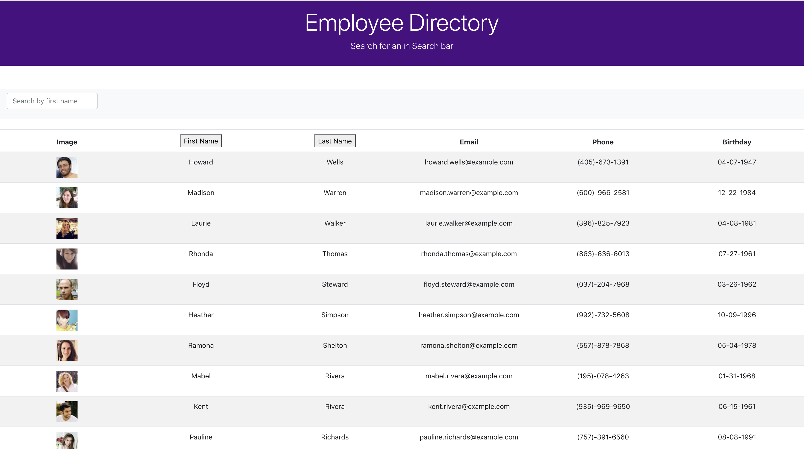
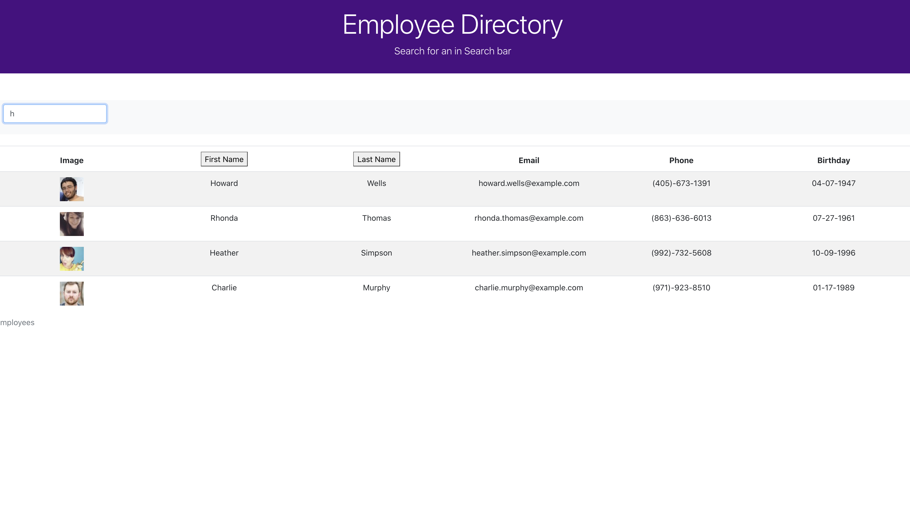

# employee directory

# Description

Employee directory that utilizes search and sort functions.This project was bootstrapped with Create React App.

# Table of Contents
* [Preview](#Preview)
* [Installation](#Installation)
* [Technology](#technology)
* [Features](#Features)
* [Contribution](#contribution)
* [Questions](#Questions)

# Deployed Website
[Employee Directory](https://pratyusharaghupatruni.github.io/employeedirectory/)

# Preview

 |HomePage|Dashboard
|--|--
||

# Installation

* Use the package manager npm to install employee-directory

<pre><code>npm install</code></pre>

* Run `npm start` to start the application.

# Technology

### React: 
* React.js is a JavaScript library that can be used to build user interfaces. With React, users can create reusable components, and these components display data as it changes over time.

### Create React App:
 * Create React App is an officially supported way to create single-page React applications. It offers a modern build setup with no configuration.

# Features
 * This project was bootstrapped with Create React App.

* User can view all employees data.

* User can search employee as well as sort employees by first name and lastname .

* Project is deployed on github pages.

# Contribution
  Please let me know the improvements of the project.Pull requests and stars are always welcome.
  

# Questions
  * If you have any questions about the repo, here is my repo 
  https://github.com/PratyushaRaghupatruni/fitness-tracker/issues/new
  * You can find  my work at https://github.com/PratyushaRaghupatruni

